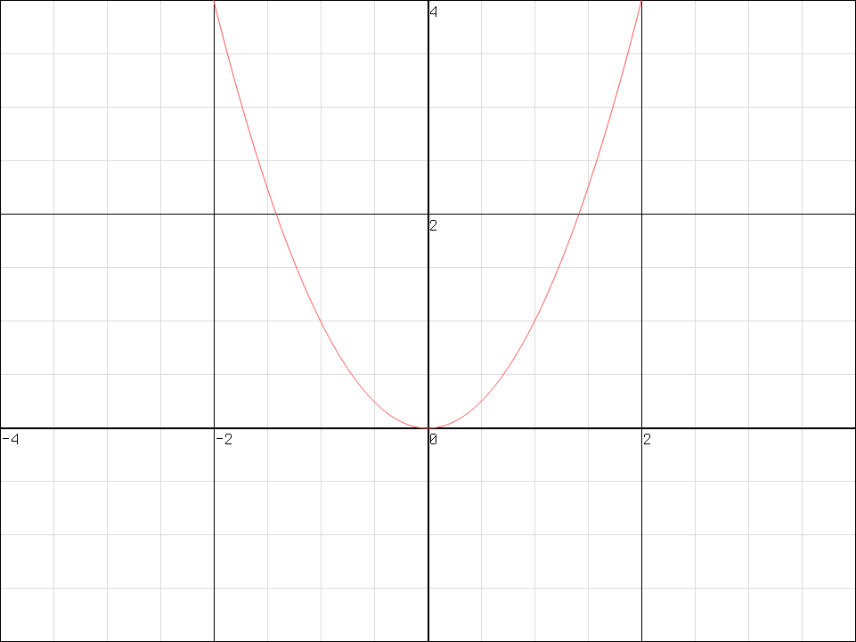
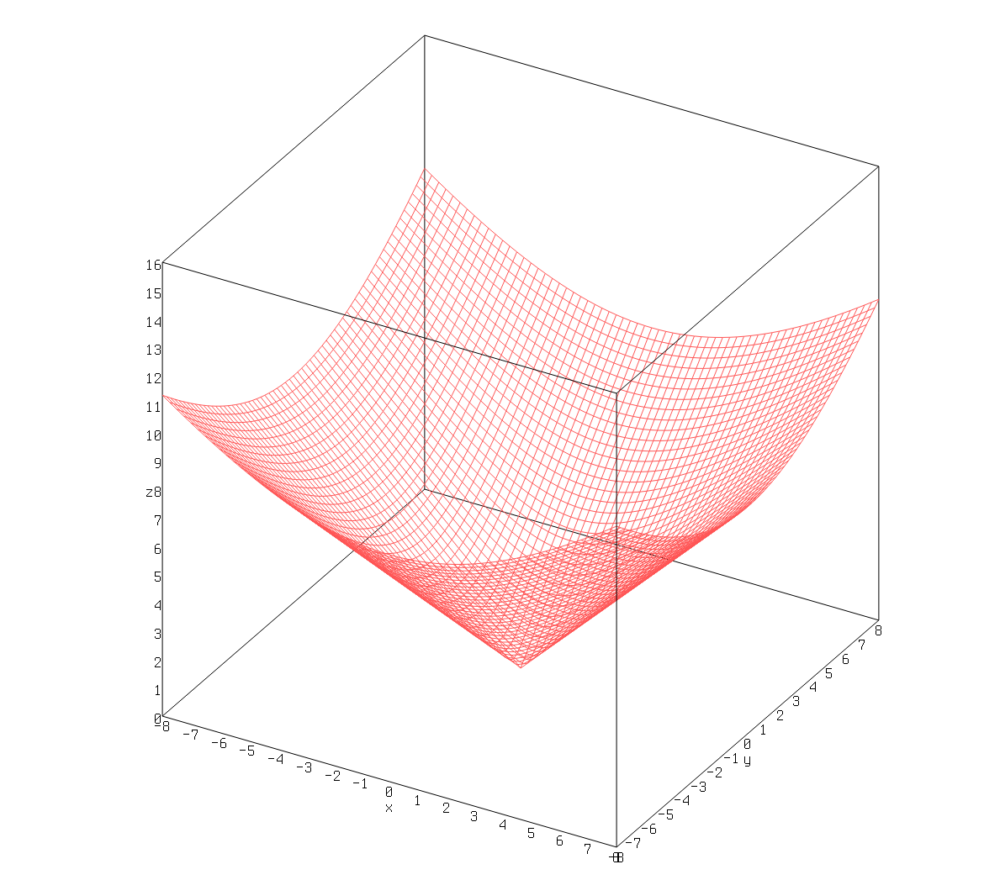

# kalc-plot

  

a [rupl](https://github.com/bgkillas/rupl) implementation using
[kalc-lib](https://github.com/bgkillas/kalc-lib) to calculate data points, expected to be used in
[kalc](https://github.com/bgkillas/kalc)

see [kalc.rs](https://kalc.rs) for a website example(currently does not support changing function like the application does)

### usage
last arg will be the functions to be ran in format of kalc, escape opens up functions menu, see kalc for info on parsing and functions, for more information on keybinds see [rupl](https://github.com/bgkillas/rupl)

### features
specifying skia in Cargo.toml instead of egui
will make a more minimal backend which is faster but less portable

